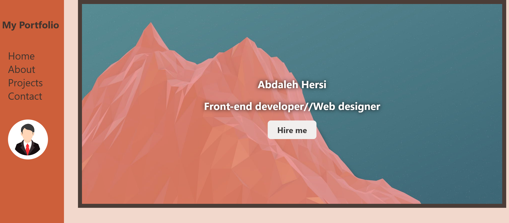
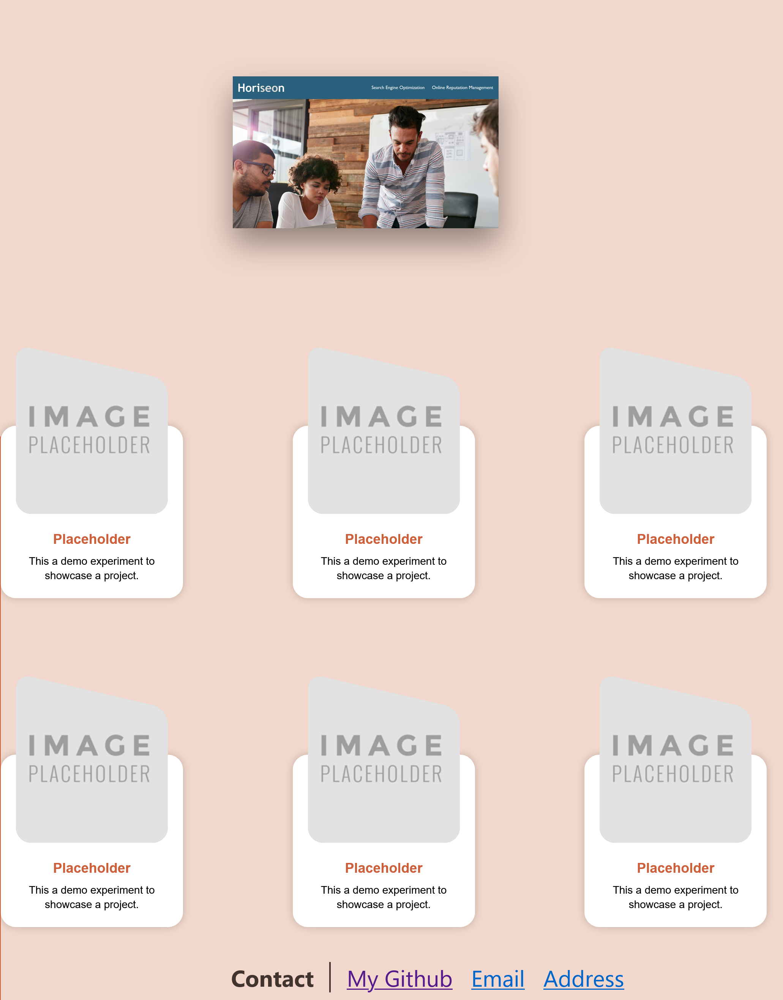

# <h1>Week 2 Bootcamp challenge</h1>

This week we were tasked with creating a deployed web portfolio for employers to view projects and work samples.

My portfolio contains projects, hero image, contact information, a working navigation bar and an adaptive web page thats responsive to different screen sizes.

# Links

[Deployed portfolio](https://abdalehhersi.github.io/challenge-2/)

[My github profile Abdaleh Hersi](https://github.com/AbdalehHersi)

[Github repository containg week 2 challenge code](https://github.com/AbdalehHersi/challenge-2)

# Resources used

[Project Card](https://codepen.io/codev_land/pen/yLXeyWX?editors=1100)

[Navigation bar](https://www.w3schools.com/howto/howto_js_sidenav.asp)

[Hero banner](https://www.youtube.com/watch?v=dJQedxalv64)

# Screenshots of the deployed portfolio

# Challenges

<li>Flexbox postioning</li>
<li>Image sizing for projects and hero banner</li>
<li>Space usage</li>

# Successes

<li>Making it responsive to mobile width</li>
<li>Making it smooth scroll to the desired sections</li>
<li>Clean navigation bar</li>

# Application requirements

<li>If the Employer clicks one of the links in the navigation
then the UI scrolls to the corresponding section</li>
<li>Employer is presented with the developer's name, a recent photo or avatar, and links to sections about them, their work, and how to contact them</li>
<li>If the Employer clicks on the link to the section about their work then the UI scrolls to a section with titled images of the developer's applications</li>
<li>When the Employer is presented with the developer's first application then that application's image should be larger in size than the others</li>
<li>When the Employer clicks on the images of the applications
then the Employer is taken to that deployed application</li>
<li>When the Employer resizes the page or view the site on various screens and devices then the Employer is presented with a responsive layout that adapts to my viewport</li>